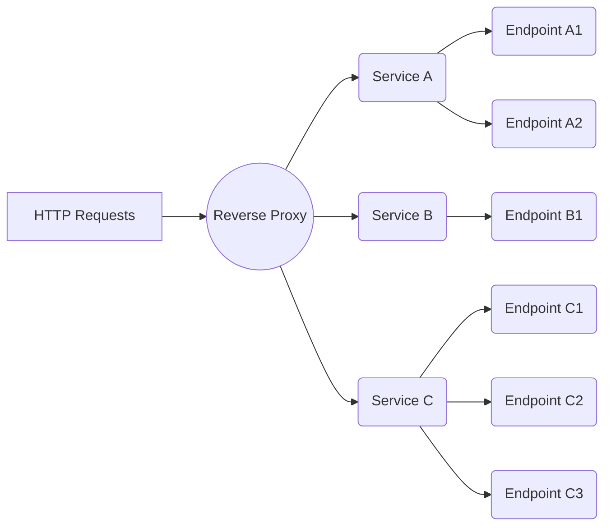

# Marcelo Adobe Reverse Proxy Test

## Components
**Entrypoint**
Central controller responsible for intercepting all http requests done to the proxy.
It processes the request, forwards it to the ReverseProxy, then returns the result to the caller. 

**ReverseProxy**
The heart of the flow, the proxy contains the list of the Services that are attached to it. It is responsible for caching 
mechanisms, circuit breaker features and load balancing.
After initialized, the ReverseProxy starts polling its service's endpoints each 10 seconds for re-evaluating their health. 
It marks them as Suspended or Active, depending on the result.

**Service**
Represents a group of Endpoints that are responding as replicas of an Application.
Each service can have its own load balancing strategies for routing the requests. 

**Endpoint**
Represents a server host & port configuration that is responding for a certain Service.
Each Endpoint has a status value to represent its health:
>*PENDING* - All newly initialized Endpoints
*ACTIVE* - All endpoints that have a successful last request
*SUSPENDED* - All endpoints that have a failed last request
*BLOCKED* - Black listed 

**Balancer**
Responsible for trying to fulfil a request using one of the available Endpoints. It tries all available Endpoints until
some of them fulfils the request or all fail. The strategy of electing which Endpoint should be the next candidate for
attempting the request depends on the routing implementation of the subclasses.

**RoundRobinLoadBalancer**
Balancer that implements the circular strategy for electing the Endpoints.

**RandomLoadBalancer**
Balancer that implements the random strategy for electing the Endpoints.

**HttpForwarder**
Helper for executing HTTP requests in remote hosts.


## Install/Delete Helm Chart:
Inside the project folder there is a "mvcp-adobe-reverse-proxy/src/main/resources/devops" directory containing the necessary files 
for launching the application in a kubernetes cluster. Switch to this directory to find the files and fire the following commands:
```bash
helm install --name marcelo-adobe-reverse-proxy --namespace marcelo-test -f values.yaml .
helm install --name marcelo-adobe-grafana --namespace marcelo-test -f grafana-values.yaml stable/grafana
helm del --purge marcelo-adobe-reverse-proxy
helm del --purge marcelo-adobe-grafana 
```

For running the reverse-proxy as a local docker image, use the following command:
```
docker run -p 9090:9090 -e REVERSE_PROXY_PORT=9090 -e REVERSE_PROXY_SERVICES="ServiceA,servicea.com,RANDOM,localhost:8000,localhost:8001,localhost:8002;ServiceB,serviceb.com,ROUND_ROBIN,localhost:9000"  marcelovcpereira/adobe-test:latest
```

PS: If you use MacOS & your docker container needs to access a local service/port, do not bind to localhost or 127.0.0.1, instead use internal docker DNS, e.g:
>docker.for.mac.host.internal:8080


## Overall Flow


## Improvements:
- Implement more Strategies of load balancing
- Externalize the configuration of the "interval of polling servers"
- Implement dynamic black list of endpoints for being used with BLOCKED status feature
- Implement persistent volumes for storing Prometheus + Grafana data
- Extract Prometheus to a separate Chart (using https://github.com/helm/charts/tree/master/stable/prometheus)